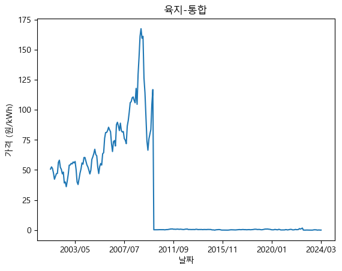
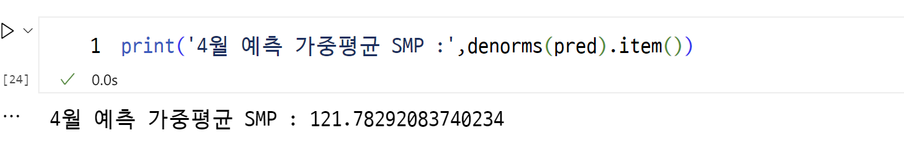

# HTML Project : 전력 가격 예측

## 0. 목차 : 전체 흐름

1. 데이터 수집
2. 데이터 시각화 : 흐름 확인
3. 모델 학습 : LSTM
4. 모델 평가 : RMSE
5. 모델 예측 : 미래 예측 -> 시각화
6. HTML 제작

### 아이디어

1. 월별 가중평균 SMP : 통합 전력으로 분석하면 되겠다
   -> 전력 가격 예측 (일단 해보기)
2. 시간대별 SMP : 의미 있는 데이터를 뽑을 수 있을까?
   - 노아 데이터가 시간대별로 정리했다.

## 1. 데이터 수집

### 수집한 자료

1. 2023년 연료원별 시간대별 설비용량 및 전력 거래량

   - MWh 단위로 전력 가격과는 무관

2. 2023년도 전력시장통계

   - 자료가 엄청 방대하다
   - 더 간단한 자료 찾기

3. 전력거래 계통한계가격 SMP
   - SMP : 육지, 제주, 통합
   - BLMP : 1열
   - 2001/04 ~ 2024/03
   - 육지 제주가 없는 날이 많음 : 통합 단위로 학습

### (학습) 거래가격 개념

#### 1. 거래가격 결정 = 한계가격 (MP) + 용량가격 (CP)

1. 한계가격 (MP) : 시간대별 수요를 충족하기 위해 운전되는 발전기의 변동비 가운데 가장 높은 값

   - 변동비 :
     - 운전비용 단가 + 기동비용 단가 = (증분비용단가+무부하단가)-발전기 변동비 특수 곡선식 + 기동비용단가
   - 계통한계가격(SMP)와 기저한계가격(BLMP)으로 구성
   - 구성 요소 : 기동비용, 무부하비용, 증분비용
     1. 기동비용 : 정지 중인 발전기의 기동에 소요되는 비용
     2. 무부하비용 : 발전기의 최소 운전비용 (무부하 가정, 원/h)
     3. 증분비용 : 발전기의 운전량 증가에 따른 비용 (원/kWh)

2. 용량가격 (CP) : 한계설비의 투자비 및 고저운전 유지비 반영
   - 해당시간대에 가용용량을 신고한 모든 발전기에 지급

#### 2. SMP를 적용시 문제점

- 유류 및 LNG 가격이 가장 높음, SMP 결정에 대부분을 점유  
  -> 연료비 등 외생변수의 지나친 영향력 발생

- 회계적 발전단가 대비 발전가격 상승  
  -> 기저설비에 과다 초과 수익 발생

#### 3. 안정화 방안

- 발전기 구분 : 기저발전기(원자력, 석탄, 국내탄 발전기), 그 외 = 일반 발전기
- 정산 방식 : 기저발전기는 BLMP, 일반발전기는 SMP 적용 + 용량 가격

#### 4. 기준 용량가격 결정

- 일반발전기 : 450MW급 복합발전기의 가스터빈 고정비 기준
- 기저발전기 : 500MW급 신규 석탄발전기의 고정비 기준

---

### 중간 정리 : 3번 데이터에선 SMP 자료를 모아야한다

- SMP는 계통한계가격, BLMP는 기저한계가격
- SMP : 육지, 제주, 통합으로 나누어져있고 데이터가 없는 구간도 있다

#### 5. 발전단가와 발전원가

### [ 발표 자료 ]


: SMP 그래프; 통합 SMP가 유일하게 전량 존재하고, 육지 SMP와 큰 차이가 없다


: 육지와 통합 가격이 큰 차이가 없음을 나타냄

=> 계통가격은 육지보다 제주가 높고 2015년 감소했다가 21년도부터 다시 증가, 최근 감소하는 추세이다. 통합 가격은 육지와 거의 동일하므로 데이터가 온전한 통합 가격을 사용한다.  
=> 설명할 땐 SMP는 유동적인 예측수요를 만족하는 한계 발전기의 발전 가격이고, 가중평균으로 해당 기간의 시세를 표현할 수 있다 판단한다.

## 2. 노아모델에 돌려보기

### 1. 데이터 전처리

- 데이터 : 2001/04 ~ 2024/03, 23년간의 SMP 데이터로 월별 기록이다.
- window는 12개월로 설정하고, 1년간의 데이터를 이용해 다음 달의 가격을 예측한다.

### 2. 모델 학습

#### 노아모델!

- 1차 학습 결과

  - 조건 : 2만 에포크, 배치 8, RNN
  - 결과 : 음수양수 오르내리는 R2
  - 원인 : 데이터가 너무 적어서?

- 2차 학습 결과

  - 조건 : 20만 에포크
  - 결과 : 동일하게 오르내림 ㅠㅠ

- 다음 할 일 : 한번 학습을 6개월 단위로 해보자

#### 할 일

1. 데이터 많은 자료 찾기
2. 어떤 데이터로 흐름을 잡을 지 고민하기
3. html 페이지 만들기

### 3. html 페이지 만들기

#### 페이지 구성

1. index.html : 메인 페이지
2. iframe1.html : 데이터 소개
3. iframe2.html : 모델 소개
4. predict.html : 예측 페이지

#### 1. index.html

[링크](index.html)

- 구성 : iframe으로 한 페이지를 보여주고 아래 버튼으로 아래로 이동
- 이것저것하다가 심플하게 스크롤하는 형식으로 결정
- 스크롤 버튼은 미구현

#### 2. iframe1.html : 간단요약

[iframe1.html 링크](iframe1.html)

- 데이터 소개 페이지
- 앞 발표 내용 : 반장이 전력 수요를 예측했고, 현길님이 에너지(원유) 가격을 예측함
- 나는 1) 최종적으로 전력 가격을 예측하고 2) 가능하면 수요와 원유 가격을 반영해 예측하고 싶다

##### 내용

- 만들다가 깨달은 거 : iframe 쭉하지말고 그 안에서 다음 페이지로 가는 링크 만들면 됨!!!

#### 3. iframe2.html : 데이터 개요

- 모델 소개 페이지
- 노아모델을 이용 : 아직 정확도는 바닥

- 와 시간 살살 녹넹...


- 일단 넣지말자 최대한 간단하게

##### 설명하기

여기서 데이터를 가져왔고, 먼저 SMP를 보았다

#### 4. iframe2_2.html : 시각화

가져온걸 시각화해봤다  
y축 지표는 SMP의 가중평균으로, 통합 SMP는 육지의 거래량이 절대적이라 육지 SMP와 거의 동일한 것으로 보인다  
따라서 데이터가 전체적으로 있는 통합 SMP를 사용하기로 결정했다

##### 고민 : 이미지를 컨테이너에 담고 슬라이드로 넘기는 방법?

html에서 이미지를 넣고 슬라이드로 넘기는 방법  
이거 한 번 써보기

```html
<!DOCTYPE html>
<html>
  <head>
    <title>Image Slider</title>
    <style>
      .container {
        width: 100%;
        height: 500px;
        overflow: hidden;
      }

      img {
        width: 100%;
        height: 500px;
        object-fit: cover;
      }

      .slider {
        display: flex;
        width: 300%;
      }

      .slide {
        width: 33.3333%;
        transition: 0.5s;
      }

      #btn {
        display: flex;
        justify-content: center;
      }

      button {
        padding: 10px;
        margin: 10px;
        background-color: #f1f1f1;
        border: none;
        cursor: pointer;
      }
    </style>
  </head>
  <body>
    <div class="container">
      <div class="slider">
        <div class="slide">
          
        </div>
        <div class="slide">
          
        </div>
        <div class="slide">
          
        </div>
      </div>
    </div>
    <div id="btn">
      <button onclick="prev()">Prev</button>
      <button onclick="next()">Next</button>
    </div>
    <script>
      let slider = document.querySelector(".slider");
      let slides = document.querySelectorAll(".slide");
      let index = 0;

      function prev() {
        index = index > 0 ? index - 1 : 0;
        update();
      }

      function next() {
        index = index < slides.length - 1 ? index + 1 : slides.length - 1;
        update();
      }

      function update() {
        let size = slides[index].clientWidth;
        slider.style.transform = `translateX(${-size * index}px)`;
      }
    </script>
  </body>
</html>
```

#### 5. iframe3.html : 모델 소개

- 모델 소개 페이지
- 노아모델
- 노아모델은 RNN을 사용하고, 1년간의 데이터를 이용해 다음 달의 가격을 예측한다
- 데이터가 너무 적어서 정확도가 떨어진다

#### 6. iframe4.html : 모델 수정

- 6개월 단위로 학습시키자
- 결과 : 높은 학습률!!

- 

예측해보기



- 실제 데이터
  

#### 7. iframe5.html : 일자별, 시간별 데이터?

- 시간별로 가격을 예측하는 건 어떨까?
- 전체 주제랑 맞는지 고민해야겠다

- 그리고 6개월치 예측자료도 필요함
- 특별한 경우 : 유가 상승, 금리 변동, 전력 수요 변화 등을 고려하지 않음을 전제